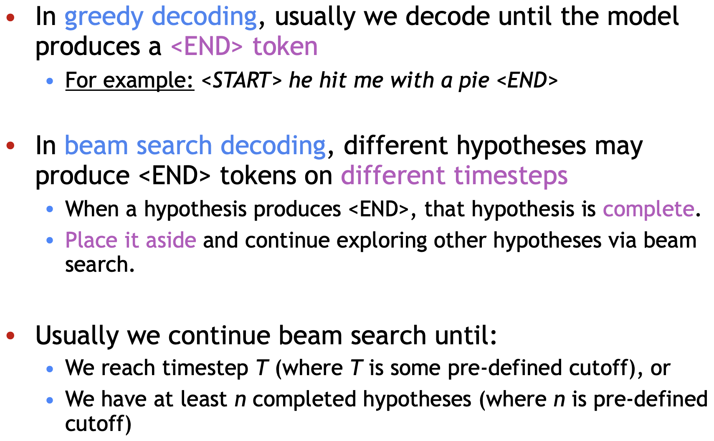

# L8 - Translation, Seq2Seq, Attention

Many of the early machine translations were **rule-based,** and then the Statistical Machine Translation \(**SMT**\), which relied on statistical information, was gradually developed. Later, the Neural Machine Translation \(**NMT**\), which used neural networks to greatly improve the accuracy, was developed. It relies on the **Sequence-to-Sequence** model architecture and the **Attention** mechanism further improves it.

## Machine Translation

## Statistical Machine Translation

### Core Idea

Learn a **probabilistic** model from data

### Language and Translation Model

### Train Translation Model

1. Large amount of **parallel** data: pairs of human-translated French/English sentences
2. Learn the alignment  

### Problem with alignment

1. Alignment might be one-to-many, many-to-one, or many-to-many, very hard to do so 

### Problem with SMT

## Neural Machine Translation

### Definition

### Seq2seq

### Application of Seq2seq

### Conditional Language Model - Seq2seq

### Training

### Cost Function

### Advantage

NMT的优势是我们可以整体的优化模型，而不是需要分开若干个模型各自优化，并且需要feature engineering较少，且模型更灵活，准确度也更高。其缺点是更难理解也更纠错，且很难设定一些人为的规则来进行控制。

### Disadvantages

## **Optimization of Seq2seq in Decoder**

### Greedy Decoding

_means_ ****take the most probable word on each step

### Problem with Greedy Decoding

可能当前的最大概率的单词对于翻译整个句子来讲不一定是最优的选择，但由于每次我们都做greedy的选择我们没机会选择另一条整体最优的路径。

### Solution: Beam search decoding

**Overview**: it walks through every possible path of $$K^2$$ number of paths/hypotheses and selects the path/hypotheses with the normalized highest score as the final decoding result

On each step of decoder, keep track of the **k most probable** partial translations \(which we call hypotheses\) • k is the beam size \(in practice around 5 to 10\)

#### Beam Search Example

### Stopping Criterion

Note: different hypotheses refer to different K, there are $$K^2$$ number of path, means that the walking path has number of $$K^2$$, they all may pass the different words.

### Problem with Beam Search

Longer hypotheses/paths = lower score \(b/c the score is negative number\)

\*\*\*\* ****

## **Evaluation of Machine Translation**

BLEU基本思想是看你machine translation中n-gram在reference translation（人工翻译作为reference）中相应出现的几率。但是可能会遇到翻译的很好但是分数很低的情况

## Difficulties Remain

## Attention

### Why Attention

Attention is designed to solve the seq2seq problem: there is a bottleneck between encoder and decoder, it was used to transfer the encoded information, which contains all the contextual information from source sentence, to the decoder. In other words, only one vector that contains all source sentence information will be passed into decoder, this causes the **problem:** 

1. Decoder forces all of the information about the source sentence from one vector, what if some information isn't in the vector \(put too much pressure to one single vector to represent entire sentence\)
2. It will lose some information when the sequence gets longer

### Definition

Attention mechanism pays specific attention on one specific part of vector when translating one specific sentence by calculating the attention score \(a scalar, dot product of two vectors, also named _similarity_\) 

### Training Procedure

1. Take the hidden state that obtained from encoder
2. Take the dot product of the current decoder hidden state and all of the hidden states inside the encoder to get the attention score \(a scalar, check their similarity\)
3. Take the softmax across all the attention score to get the attention distribution \(sum to 1\)
4. Take the weighted concatenate of softmax-ed attention score and the hidden state to get the context vector  
5. Take the concatenate of context vector and current decoder hidden state in order to 对于当前输出位置得到比较重要的输入位置的权重，在预测输出时相应的会占较大的比重
6. Repeat 2 - 5 until the last word

 

  

### Procedure in Equation 

### Advantage

##  

\*\*\*\*

